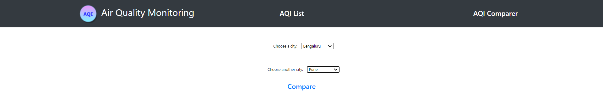
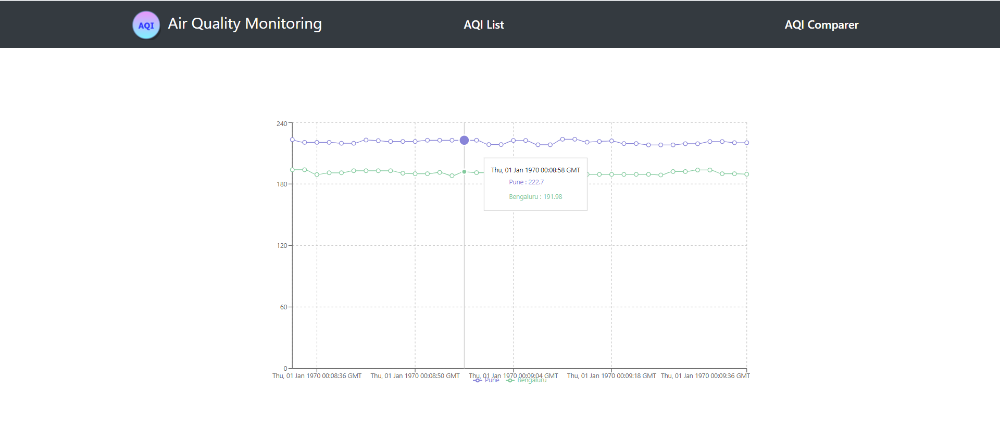

# Getting Started with Create React App

This project was bootstrapped with [Create React App](https://github.com/facebook/create-react-app). Read more about it [here](./PROJECT.md)

## Air Quality Monitoring

The application is built using React (functional components, Typescript, Context API) and Express.

There are 2 major pages in the application

- Dashboard - this shows the list of cities, their AQI and the date when AQI was last updated. On clicking the individual city entry in the dashboard table, you will be redirected to another page showing the city's AQI trend for a maximum of 20 data points (configurable in code) to save some memory and to make the graph look cleaner (too many data points clutter the graph).

     

     

- AQI Comparer - This page will prompt to choose any 2 cities for which data is available and will plot a corresponding graph comparing the API for 2 cities.

    

    

## Technologies/ Libraries used

- React
- React Router
- Context API
- React Hooks
- Web Sockets
- React Bootstrap
- Express

## Deployment

The app is deployed to [heroku](https://air-quality-assessment.herokuapp.com/).

---

### NOTE

Do not directly navigate to `/dashboard`. Open the heroku app using above link and then click on the `Air Quality Monitoring` icon or the `Dashboard` link in the Navigation bar

---

## Time taken

10 hours
